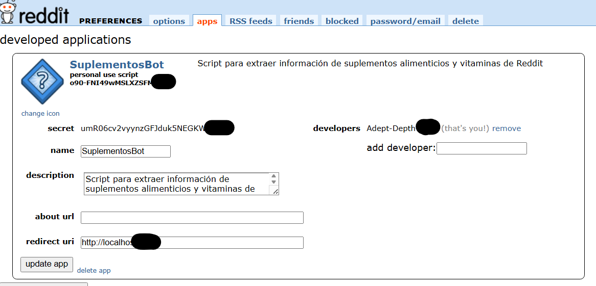
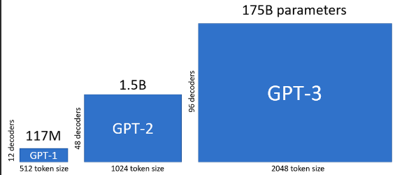
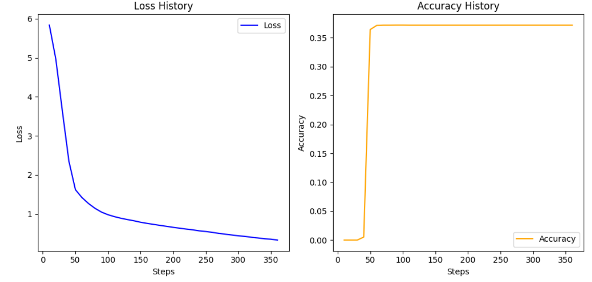

# Healthy Chat Bot using LLMs
## Index
- [Healthy Chat Bot using LLMs](#healthy-chat-bot-using-llms)
  - [Index](#index)
  - [Introduction](#introduction)
  - [Objective](#objective)
  - [Key Features](#key-features)
  - [General Methodology](#general-methodology)
    - [Data Extraction](#data-extraction)
    - [Data Preprocessing](#data-preprocessing)
    - [Model Fine-Tuning](#model-fine-tuning)
      - [**Choose a pre-trained model**:](#choose-a-pre-trained-model)
      - [**Prepare Training Data**:](#prepare-training-data)
      - [**Train the Model**:](#train-the-model)
      - [**Loss History (Left Graph):**](#loss-history-left-graph)
      - [**Accuracy History (Right Graph)**:](#accuracy-history-right-graph)
    - [Chatbot Development:](#chatbot-development)
      - [Chatbot Deployment Using Gradio](#chatbot-deployment-using-gradio)
      - [Key Features of Gradio:](#key-features-of-gradio)
      - [Code for Deploying the Chatbot with Gradio:](#code-for-deploying-the-chatbot-with-gradio)
  - [Conclusion](#conclusion)

## Introduction

This project focuses on the development of an intelligent chatbot using Large Scale Language Models (LLMs) to provide information and advice Personalized health and wellness tips.

## Goal

Develop a chatbot that provides personalized information and advice related to tips, recipes, and vitamins based on each user's individual goals.

## Key Features

1. **Personalized Tips**: Offer tailored advice on how to effectively use supplements and vitamins according to the user's specific health and wellness goals, such as improving energy levels, boosting immunity, improving muscle growth, or maintaining overall well-being.

2. **Recipes**: Provide users with healthy recipes that incorporate specific vitamins and supplements, suited to their dietary preferences and health goals.

3. **Vitamin Recommendations**: Suggest appropriate vitamins and supplements based on the user's goals, dietary restrictions, or lifestyle needs. For example, recommending Vitamin D for someone looking to improve bone health or Vitamin C to boost immunity.

## General Methodology

The general methodology of the project is divided into four main phases:

1. Data Extraction
2. Data Preprocessing
3. Model Fine-Tuning
4. Chatbot Development

### Data Extraction

1. **Identify relevant subreddits**: Start by identifying subreddits that discuss supplements, vitamins, recipes, and health tips.

2. **Access the Reddit API**: Use the Reddit API to collect data. You will need to register an application with Reddit to obtain credentials (client ID, client secret, and user agent).
    [Accede a la página de aplicaciones de Reddit.](https://www.reddit.com/prefs/apps "Accede a la página de aplicaciones de Reddit.")

  

3. **Data Extraction**: Write scripts to extract posts and comments relevant to the topics of interest. Use keywords like “tips,” “recipes,” “vitamins,” “supplements,” “energy,” “immunity,” etc., to filter the content.
   
  ```python
        import praw

        # Inicializar el cliente de la API de Reddit
        reddit = praw.Reddit(
            client_id="o90-FNI49wMSLXZSFMy***",
            client_secret="umR06cv2vyynzGFJduk5NEGKWbu***",
            user_agent="SuplementosBot/0.1 by Adept-Depth-7***"
        )

        # Definir los subreddits y palabras clave relevantes
        subreddits = ['supplements', 'vitamins', 'nutrition']
        keywords = ['vitamin', 'supplement', 'nutrient', 'mineral']
   ```

### Data Preprocessing

1. **Clean Data**: Remove unnecessary text such as URLs, HTML tags, special characters, and emojis. Text is also normalized by converting it to lowercase.
     ```python
       def clean_text(text):
                # Check if the text is a list and convert it to a string
                if isinstance(text, list):
                    text = ' '.join(text)
                
                # Remove HTML tags
                text = re.sub(r'<.*?>', '', text)
                # Remove emojis
                text = re.sub(r'[𐀀-􏿿]', '', text)
                # Remove URLs
                text = re.sub(r'http\S+', '', text)
                # Remove special characters and numbers
                text = re.sub(r'[^a-zA-Z\s]', '', text)
                return text
    ```

2. **Tokenization**: Split the text into individual words or tokens. This can help understand the frequency and importance of different terms related to supplements and vitamins.

3. **Remove Stop Words**: Remove common words that do not contribute to understanding the context, such as “and,” “the,” “is,” etc.

4. **Text Classification**: Classify the data extracted in prompt as user questions and completion of possible answers to train the chatbot

### Model Fine-Tuning

#### **Choose a pre-trained model**: 
GPT-2 (Generative Pre-trained Transformer 2) is a cutting-edge language model developed by OpenAI. It’s based on the `Transformer `architecture, particularly utilizing the decoder part of the original Transformer model. GPT-2 uses self-attention mechanisms to process and generate text, making it highly effective at understanding context and handling long-range dependencies in text.

  

#### **Prepare Training Data**:
To fine-tune the model for a question-answering scenario, it's crucial to prepare a dataset that follows a structured and consistent format. The following JSON structure was used effectively for training in similar scenarios:

  ```json
          {
          "prompt": "my prompt ->",
          "completion": "the answer of the prompt. \n"
          }
  ```
In this format, `prompt` represents the question or statement to which a response is sought, and `completion` contains the expected answer. Ensuring that all data pairs are uniformly structured helps the model understand and learn the desired response pattern. Consistency in formatting facilitates better adaptation to the specific task of answering questions, enhancing the model's ability to generate accurate and coherent responses.

#### **Train the Model**: 
Fine-tuning GPT-2 with categorized data

Once a pre-trained GPT-2 model is selected, the next step is fine-tuning it with specific data related to the task. Fine-tuning involves updating the model's weights using a new dataset that matches the desired application, allowing GPT-2 to specialize in generating more task-relevant text while retaining its pre-trained knowledge. 

**GPT-2 Fine-Tuning Process**
- **Pre-training**: Initially, GPT-2 is trained on vast internet data, learning to predict the next word in a sequence. This step teaches it general language understanding.
- **Fine-tuning**: In the fine-tuning phase, the model is updated using categorized or task-specific data. This improves its performance on the specific task you are training it for, whether it’s chatbot dialogue, text completion, or any other NLP task.

The following configurations help guide the fine-tuning process efficiently:

**Training Arguments**  
To customize the training process, several hyperparameters and settings can be adjusted via the `TrainingArguments` class from Hugging Face's `Transformers` library. These arguments control key aspects of how GPT-2 learns from your dataset.

```python
training_args = TrainingArguments(
    output_dir=OUTPUT_DIR,               # Directory to save model checkpoints
    per_device_train_batch_size=8,       # Batch size per device during training
    num_train_epochs=15,                 # Number of training epochs
    logging_dir=LOGGING_DIR,             # Directory for logs
    logging_steps=10,                    # Log every 10 steps
    evaluation_strategy="steps",         # Evaluate the model after each logging step
    save_steps=10_000,                   # Save the model checkpoint every 10,000 steps
    save_total_limit=2,                  # Limit to keep only 2 model checkpoints
    learning_rate=5e-5,                  # Set the learning rate to fine-tune GPT-2
    warmup_steps=500,                    # Warm-up for the first 500 steps to stabilize learning
    weight_decay=0.01                    # Add weight decay to improve generalization
)
```
 In the fine-tuning process, these graphs provide crucial insights into the model's performance over the course of training:
  

 #### **Loss History (Left Graph):**
 - **Y-axis (Loss)**: Represents the loss, which is a measure of how well the model is performing. Lower loss values indicate that the model is improving.
- **X-axis (Steps)**: Refers to the number of training steps completed during fine-tuning.
 - **Curve**: The loss starts relatively high (around 6), but as the training progresses, it steadily decreases. This signifies that the model is learning and improving over time. Around step 50, the loss significantly drops, and afterward, the curve flattens out, indicating that the model is converging, with fewer improvements occurring as it approaches its optimal state.

#### **Accuracy History (Right Graph)**:
  - **Y-axis (Accuracy)**: Represents the accuracy of the model, which is a measure of how many predictions it gets correct. Higher accuracy values are better.
 - **X-axis (Steps)**: Like the loss graph, this represents the number of training steps.
- **Curve**: The accuracy starts near zero, but after around 50 steps, there is a sharp increase. The accuracy reaches a plateau around 35%, which remains consistent after step 100. This indicates that the model quickly learned from the data and achieved a stable level of performance.


### Chatbot Development:
#### Chatbot Deployment Using Gradio

Gradio is a Python library that simplifies the creation of interactive graphical user interfaces (GUI) for machine learning models. It allows you to quickly deploy models on a web-based interface that is easy to use without complex configurations. It is especially useful for NLP projects, like using GPT-2, to create simple chat interfaces.

#### Key Features of Gradio:
- **Simplicity**: Enables the creation of GUIs with just a few lines of code.
- **Compatibility with ML models**: Supports integration with deep learning models developed using PyTorch, TensorFlow, and Hugging Face Transformers.
- **Ease of sharing**: Interfaces created can be shared via public links without the need for additional setup.

#### Code for Deploying the Chatbot with Gradio:

```python
import gradio as gr
import torch
from transformers import GPT2Tokenizer, GPT2LMHeadModel

# Load the fine-tuned tokenizer and model
tokenizer = GPT2Tokenizer.from_pretrained('./results')
model = GPT2LMHeadModel.from_pretrained('./results')
tokenizer.pad_token = tokenizer.eos_token  # Set padding token

# Function to generate responses
def generate_response(prompt):
    input_ids = tokenizer.encode(prompt, return_tensors='pt')  # Convert input text into tokens
    with torch.no_grad():  # Disable gradient calculations to improve performance
        outputs = model.generate(
            input_ids,
            max_length=100,              # Maximum length of the generated response
            pad_token_id=tokenizer.eos_token_id,  # Padding token
            do_sample=True,              # Use sampling for diverse responses
            top_k=50,                    # Top-k sampling
            top_p=0.95                   # Top-p sampling (nucleus sampling)
        )
    response = tokenizer.decode(outputs[0], skip_special_tokens=True).strip()  # Decode the output tokens into text
    return response

# Create the interface with Gradio
iface = gr.Interface(fn=generate_response, inputs="text", outputs="text", title="Chatbot")
iface.launch(share=True)  # Share the interface through a public link
```
<iframe src="https://182124d255e5e056ff.gradio.live/" width="800" height="600"></iframe>

## Conclusion

By using pre-trained LLM models, fine-tuning or transfer learning can be applied to leverage the knowledge of these models and adapt them to a specific domain. In this use case, training was applied to data related to dietary supplements and vitamins, resulting in accurate responses at first glance.